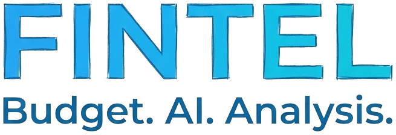

<div align="center">
  
</div>

# **FINTEL – Akıllı Finans Asistanı**

Kişisel bütçeni takip eden, harcamalarını analiz eden ve Nova ile sohbet ederek finansal öneriler almanı sağlayan modern bir finans yönetim uygulaması.

---

## **🏷️ Teknoloji Rozetleri**

<div align="center">


</div>

---

## **📌 Proje Hakkında**

Bu proje, **Gemini tarafından otomatik oluşturulan V1 uygulamasının**, tamamen *vibecoding* yaklaşımıyla **baştan düzenlenmiş**, geliştirilmiş ve modern bir finans asistanına dönüştürülmüş halidir.

Arayüz, kullanıcı deneyimi, Nova entegrasyonu, sohbet sistemi, dönem hesaplama mantığı, AI prompt mimarisi ve tüm iş akışları **manüel olarak yeniden tasarlanmıştır**.

> Bu repo, "AI + Human Vibe" yaklaşımının bir örneğidir.

---

## **✨ Ana Özellikler**

### **🔹 Nova – AI Finans Asistanı**
- Gemini Flash 2.0 ile gerçek zamanlı bağlamsal analiz
- Dönem bilgilerini anlama, yorumlama ve kullanıcıya göre cevap verme
- Esprili ve samimi sohbet
- Markdown formatlı raporlar
- Chat & analiz geçmişi cache (sessionStorage)

### **🔹 Bütçe Yönetimi**
- Gelir / gider kayıtları
- Dönem bazlı bütçe çerçevesi
- Günlük harcama limiti
- Kategorilere göre analiz

### **🔹 Kullanıcı Sistemi**
- Google OAuth
- E‑posta + şifre (Firebase Auth)
- Misafir (anonymous) kullanıcı modu

### **🔹 UI / UX**
- Modern tasarım (Tailwind + özel bileşenler)
- Responsive
- Sidebar + mobil header
- Karanlık tema uyumu

---

## **📁 Kısaltılmış Proje Yapısı**

```txt
main/
 ├─ components/
 │   ├─ AIAdvisor.tsx
 │   ├─ Dashboard.tsx
 │   ├─ Settings.tsx
 │   ├─ Calendar.tsx
 │   ├─ History.tsx
 │   └─ ...
 ├─ services/
 │   ├─ geminiService.ts   # Nova'nın beyni
 │   ├─ authService.ts
 │   └─ firestoreService.ts
 ├─ types/
 ├─ App.tsx
 └─ index.tsx
 └─ logo/
     ├─ favicon.ico
     ├─ logo1.png
     └─ logo2.png

```

## **🚀 Uygulamayı Çalıştırma**

### **1) Depoyu klonla**
```sh
git clone https://github.com/AhmetDemiroglu/expense-tracker-v2
cd expense-tracker-v2
```

### **2) Bağımlılıkları yükle**
```sh
npm install
```

### **3) Ortam değişkenlerini ayarla**
`.env.local` dosyası oluştur:

```env
VITE_GEMINI_API_KEY=YOUR_GEMINI_KEY
VITE_FIREBASE_API_KEY=YOUR_FIREBASE_KEY
VITE_FIREBASE_AUTH_DOMAIN=xxx
VITE_FIREBASE_PROJECT_ID=xxx
VITE_FIREBASE_STORAGE_BUCKET=xxx
VITE_FIREBASE_MESSAGING_SENDER_ID=xxx
VITE_FIREBASE_APP_ID=xxx
VITE_FIREBASE_MEASUREMENT_ID=xxx
```

### **4) Geliştirme sunucusunu başlat**
```sh
npm run dev
```

---

## **📦 Üretim İçin Build Alma**
```sh
npm run build
```

---

## **🚀 Firebase Deploy**

### İlk deploy:
```sh
firebase init hosting
```
Seçenekler:
- Existing project → seç
- Public directory → `dist`
- SPA rewrites → yes

### Yayına alma:
```sh
firebase deploy --only hosting
```

---

## **🧠 Notlar**
- Uygulama React + TypeScript + Vite + Firebase üçlüsünün modern yapısıyla geliştirildi.
- Nova’nın tüm kişilik yapısı ve finans analiz mantığı özel olarak yazılmıştır.
- AI entegrasyonu *tek yönlü Q/A değil*, geniş bağlamlı hesaplama + dönem bilgisi + harcama profili + kullanıcı tonu içerir.

---

## **👨‍💻 Geliştirici**
**Ahmet Demiroğlu**

Nova ile birlikte finansal farkındalığı güçlendiren modern bir kişisel finans uygulaması.

---
